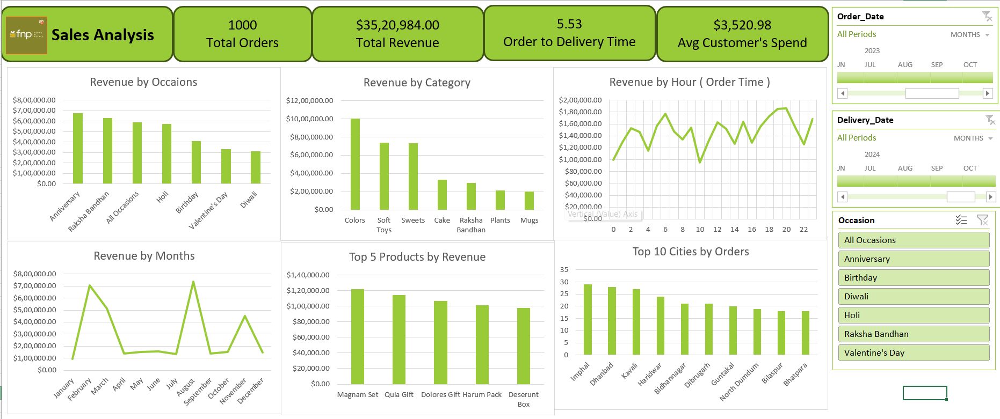

# 📊 Excel Sales Analysis Dashboard  

This project is an **interactive Excel Dashboard** built using **Power Query & Excel visualization tools**.  
It analyzes **Ferns and Petals Sales Data** to uncover trends, customer behavior, and business performance.  

---

## 📂 Project Structure  

Excel-Sales-Analysis-Dashboard/
│
├── data/
│   ├── customers.csv             # Customer dataset
│   ├── orders.csv                # Orders dataset
│   └── products.csv              # Product details
│
├── docs/
│   ├── project_overview.png      # Dashboard screenshot
│   └── sales_analysis_question.pdf  # Problem statement
│
├── Final_Sales_Dashboard.xlsx    # Main Excel Dashboard  
├── Executive_Summary.pdf         # Executive summary report  
└── README.md                     # Documentation  

---

## 📸 Dashboard Preview  



---

## 🔑 Executive Summary  

This Sales Analysis Dashboard provides a **comprehensive overview of sales performance** using Excel and Power Query.  

### **Key Metrics**
- **Total Orders:** 1,000  
- **Total Revenue:** ₹35,20,984  
- **Average Customer Spend:** ₹3,520.98  
- **Order to Delivery Time:** 5.53 days  

### **Key Insights**
1. **Top Occasions:** Anniversary and Raksha Bandhan drive the highest sales.  
2. **Best Categories:** Colors, Soft Toys, and Sweets generate maximum revenue.  
3. **Seasonality:** March & August show festival-driven revenue peaks.  
4. **Customer Behavior:** Evening hours (6–9 PM) contribute maximum sales.  
5. **Top Products:** Magnam Set and Quia Gift dominate product sales.  
6. **Geographic Trends:** Imphal, Dhanbad, and Kavali cities lead in orders.  

### **Conclusion**  
By combining **Power Query for ETL (Extract, Transform, Load)** and **Excel dashboards for visualization**, this project transforms raw data into **actionable business insights** that support better decision-making in marketing, product strategy, and customer engagement.  

---

## 🛠 Tools & Techniques Used  
- **Power Query**: Data cleaning, transformation, and automation  
- **Microsoft Excel**:  
  - Pivot Tables & Pivot Charts  
  - Interactive Slicers & Filters  
  - Conditional Formatting & KPIs  
- **Datasets**: Customers, Orders, Products  

[View Full Executive Summary (PDF)](docs/Executive Summary.pdf)

---

## 🚀 How to Use  
1. Download or clone this repository:  
   ```bash
   git clone https://github.com/TalariRamesh/Excel-Sales-Analysis-Dashboard.git

2. Open Final_Sales_Dashboard.xlsx in Microsoft Excel.

3. Interact with the slicers and filters to analyze revenue by occasions, categories, time, and cities.

4. Use Power Query Editor to refresh datasets with new data.

👨‍💻 Author

Developed by Ramesh Talari – Aspiring Data Analyst 🚀

💼 LinkedIn Profile - https://www.linkedin.com/in/ramesht1/

📧 Email: talarirg12@gmail.com

